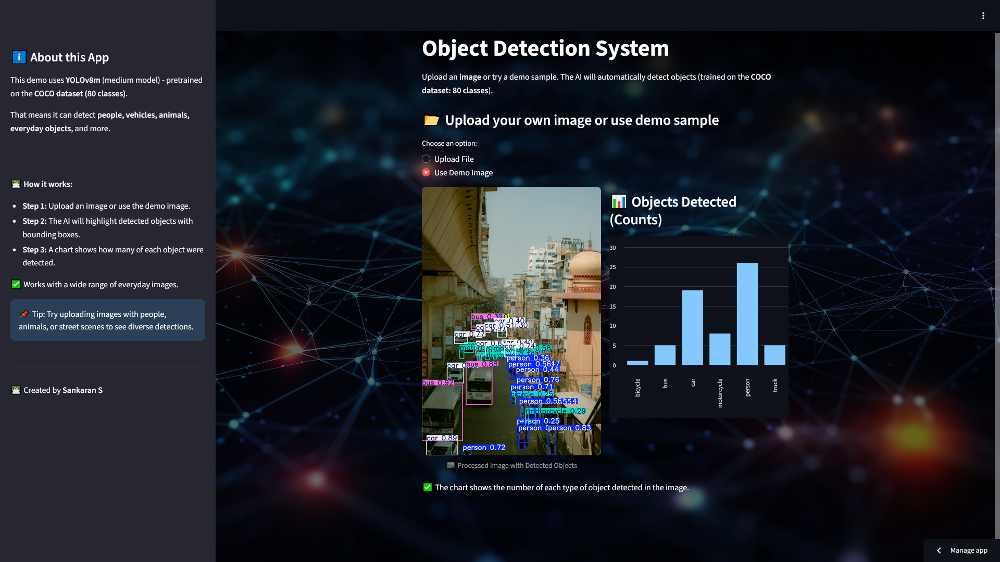

# 🧐 Object Detection Recognition System

[](https://streamlit.io) [](https://www.python.org/) [](https://github.com/ultralytics/ultralytics) [](https://opencv.org/) [](https://pandas.pydata.org/)


Detect objects in images instantly using a simple AI-powered web app.



**[Live Demo - Try it here!](https://object-detection-recognition-system-gvtatwq7wyqx7ws9xohbwq.streamlit.app/)**

***

## 🎯 What This Project Does

- Automatically finds and labels objects in images
- Highlights detected objects with boxes and names
- Shows count of each object as a chart
- Works for common things: people, cars, pets, and more

***

## 🚀 Key Features

- **Easy Upload** - Supports JPG and PNG images
- **Fast Results** - Detects in seconds thanks to YOLOv8
- **Clean UI** - Custom background, two-column layout
- **Bar Chart** - Displays how many of each object found
- **Demo Option** - Try with sample image included

***

## 🧐 How It Works

1. **Upload your image** or use the demo provided
2. The AI model scans and marks every object found
3. Detected objects are listed and counted in a chart
4. See the processed image and the chart side by side

***

## 🏗️ Technologies Used

- **Python** - Programming language
- **Streamlit** - Simple UI \& fast deployment
- **YOLOv8** - State-of-the-art object detection
- **OpenCV** - Image reading and processing
- **Pandas** - Data table and chart

***

## 📂 Project Structure

```
Object-Detection-Recognition-System/
├── app.py                    # Main web application
├── requirements.txt          # Python dependencies
├── background_image.jpg      # App background image
├── object detection.ipynb    # Development notebook
├── test_image1.jpg           # Demo/sample image
└── test_video2.mp4           # (For video extension, not used in this app)
```


***

## 🛠️ How to Run

1. **Install dependencies**
```bash
pip install -r requirements.txt
```

2. **Run the application**
```bash
streamlit run app.py
```


***

## 🤗 What You Learn

- Using deep learning models for computer vision
- Building interactive web apps with Streamlit
- Handling and processing images in Python
- Plotting simple charts from detection results

***

## 📈 Results

- Accurate object detection for 80+ common items (COCO dataset)
- Real-time feedback: processed image + chart
- No code or ML knowledge required—just upload and go!

***

## 💡 Possible Improvements

- Add support for video detection (see test_video2.mp4)
- Detect custom objects with retrained models
- Display detection confidence scores
- Expand to real-time webcam detection

***

## ✉️ Contact

**Sankaran S**  
[](https://github.com/sankaran-s2001) [](https://www.linkedin.com/in/sankaran-s21/) [](mailto:sankaran121101@gmail.com)


*Showcasing computer vision skills through real-world object detection. Perfect for identifying everyday objects in images with AI-powered YOLOv8!*

***

⭐ *If you liked this project, please star the repository!*
